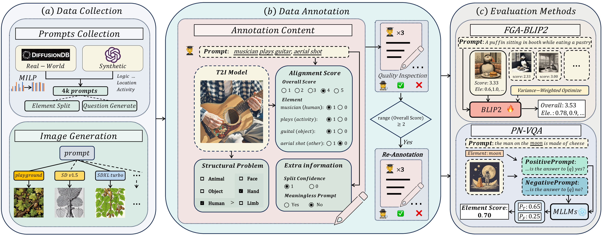
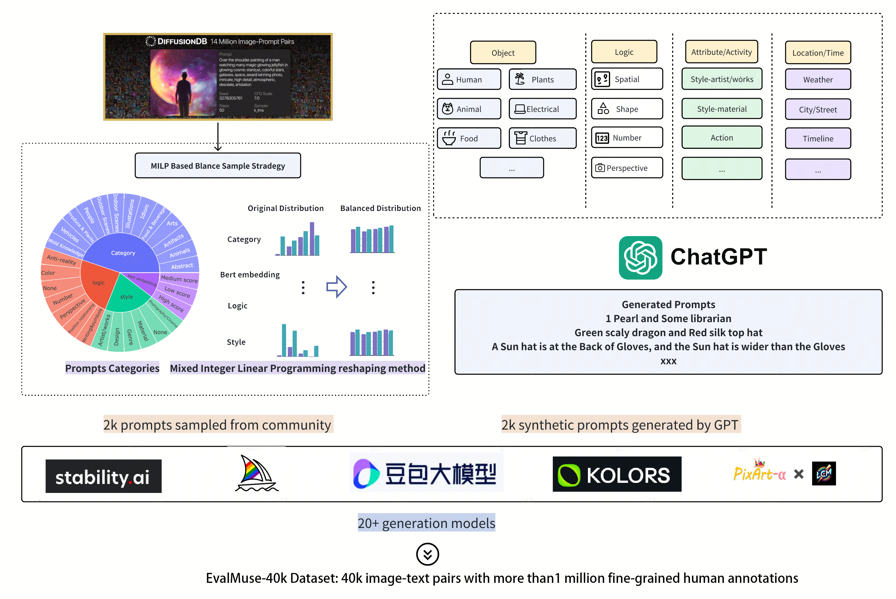
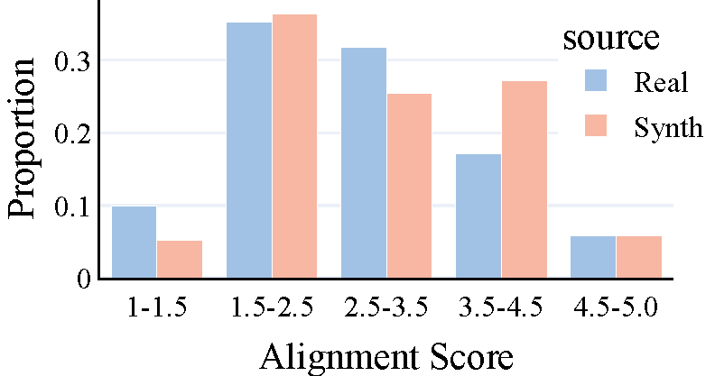
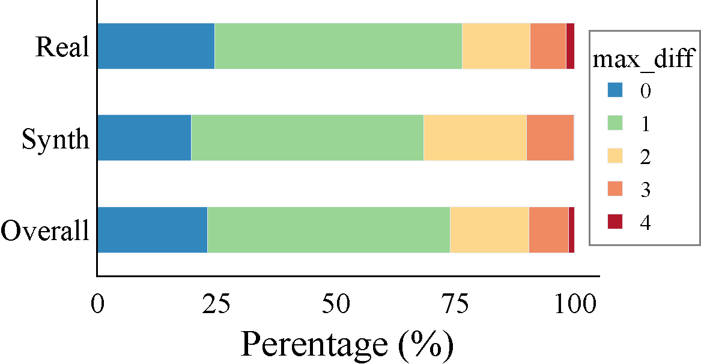

<div align="center">
   <h1>EvalMuse-40K: A Reliable and Fine-Grained Benchmark with Comprehensive Human Annotations for Text-to-Image Generation Model Evaluation</h1>
   <i>How to evaluate Text to Image Generation Model properly?</i>
   <div>
      <!-- <a href="https://github.com/DYEvaLab/EvalMuse"></a> -->
      <a href="https://arxiv.org/abs/2412.18150"></a>
      <a href="https://shh-han.github.io/EvalMuse-project/"></a>
      <a href="https://huggingface.co/datasets/DY-Evalab/EvalMuse"></a>
      <a href="https://shh-han.github.io/EvalMuse-Leaderboard/#/"></a>
      <a href="https://hits.seeyoufarm.com"></a>
      
   </div>
      <p align="center">
      
   </p>
</div>


### Table of Contents
- [Updates](#updates)
- [Key Features](#keyfeatures)
- [Introduction](#introduction)
- [Getting Started](#gettingstarted)
- [Data Statistics](#datastatistics)
- [Submission Gudideline](#submission_gudide_line)
- [Evaluation Method ToolKit](#evaluation_method_toolkit)
- [Contributing](#contributing)
- [Results](#results)
- [Citation and Acknowledgement](#citation_and_acknowledgement)


<a name="updates"></a>
## :fire: Updates
- [13/12/2024] **Codes and Dataset** released: We releaded the traning part of evalmuse dataset(30k) and code of fga-blip2, which acheived SOTA performance in T2I model alignment evaluation.
- [25/12/2024]
   - **EvalMuse-40k Report** released: [](https://arxiv.org/abs/2412.18150).You can find our technical report on arxiv.<br/>
   - **EvalMuse Leaderboard** released: [](https://shh-han.github.io/EvalMuse-Leaderboard/#/). You can find EvalMuse leaderboard on our website.The leaderboard contains three tracks: T2I alignment metric ranking, T2I fidelity metric ranking and T2I model alignment abality ranking.


<a name="introduction"></a>
### Introduction
EvalMuse-40K is a reliable and fine-grained benchmark designed to evaluate the performance of Text-to-Image (T2I) generation models. It comprises 40,000 image-text pairs with comprehensive human annotations for image-text alignment-related tasks.Based on this dataset, we proposed two methods to evaluate t2i alignment automatically: FGA-BLIP2 and PN-VQA.
   </div>
      <p align="center">
      
   </p>
</div>

<a name="keyfeatures"></a>
### Key Features

- **Large-scale T2I Evaluation Dataset**: Includes 40,000 image-text pairs with over 1 million fine-grained human annotations.
- **Diversity and Reliability**: Employs strategies like balanced prompt sampling and data re-annotation to ensure diversity and reliability.
- **Fine-grained Evaluation**: Categorizes elements during fine-grained annotation, allowing evaluation of specific skills at a granular level.
- **New Evaluation Methods**: Introduces FGA-BLIP2 and PN-VQA methods for end-to-end fine-tuning and zero-shot fine-grained evaluation.
- **Leader Board**:We are maintaining a ranking list of T2I models that updates weekly, shows the cutting-edge process of T2I models.
<a name="gettingstarted"></a>
## Getting Started

To use the EvalMuse-40K dataset and replicate the experiments, follow these steps:

1. **Clone the Repository**:
   ```bash
   git clone https://github.com/DYEvaLab/EvalMuse
   cd EvalMuse
   ```
2. **Install Dependencies**:
   ```bash
   pip install -r requirements.txt
   ```
3. **Download the Dataset and Preprocess the Data**:
   ```bash
   # Download the dataset from Huggingface
   sh scripts/download.sh

   # Average the annotation scores and calculate the variance of the alignment scores for different image-text pairs corresponding to the same prompt
   python3 process/process_train.py

   # Corresponds the element split from the prompt to a specific index in the prompt
   python3 process/element2mask.py
   ```
4. **Run the Training Scripts**:
   ```bash
   sh scripts/train.sh
   ```
5. **Evaluate the Models**:

   You can download the pre-trained FGA-BLIP2 model weights from 
   [[Huggingface](https://huggingface.co/hanshuhao/FGA-BLIP2/resolve/main/fga_blip2.pth?download=true)]
   or [[Baidu Cloud](https://pan.baidu.com/s/1spi1E9AjQ6xNW_Wqufgm9w?pwd=tgyq)].
   ```bash
   sh scripts/eval.sh
   ```
<a name="datastatistics"></a>
## Data Statistics

- **Alignment Score Distribution**: It can be seen that the alignment scores are widely distributed, providing a rich sample for evaluating the consistency of existing models in metrics of image-text alignment with respect to human preferences.
<p align="center">
   
</p>

- **Differences in Human Preferences**: We found 75% of alignment scores differ by less than 1, showing high annotation consistency. For larger differences, we re-annotated to reduce bias.
<p align="center">
   
</p>

- **Fine-Grained Annotation Quantity and Scores**: 
Most categories have alignment scores around 50%, ensuring balanced positive and negative samples. And we found that AIGC models show weaker consistency in counting, spatial relationships, and activities
<p align="center">
   
</p>

<a name="results"></a>
## Results
It is recommanded to find out detailed ranking results and fine-grained level analysis on our leaderboard website.[](https://shh-han.github.io/EvalMuse-Leaderboard/#/)
### Results on overall alignment scores

Quantitative comparison between our FGA-BLIP2 and other state-of-the-art methods which only use image-text pair to output overall alignment score on multiple benchmarks. Here, `var` refers to the variance optimization strategy, `os` represents the overall alignment score output by FGA-BLIP2, and `es_avg` is the average of the element scores output by FGA-BLIP2.

| Method                        | EvalMuse-40K (SRCC) | EvalMuse-40K (PLCC) | GenAI-Bench (SRCC) | GenAI-Bench (PLCC) | TIFA (SRCC) | TIFA (PLCC) | RichHF (SRCC) | RichHF (PLCC) |
|-------------------------------|---------------------|---------------------|--------------------|--------------------|-------------|-------------|---------------|---------------|
| CLIPScore                     | 0.2993             | 0.2933             | 0.1676            | 0.203              | 0.3003      | 0.3086      | 0.057         | 0.3024        |
| BLIPv2Score                   | 0.3583             | 0.3348             | 0.2734            | 0.2979            | 0.4287      | 0.4543      | 0.1425        | 0.3105        |
| ImageReward                   | 0.4655             | 0.4585             | 0.34              | 0.3786            | 0.6211      | 0.6336      | 0.2747        | 0.3291        |
| PickScore                     | 0.4399             | 0.4328             | 0.3541            | 0.3631            | 0.4279      | 0.4342      | 0.3916        | 0.4133        |
| HPSv2                         | 0.3745             | 0.3657             | 0.1371            | 0.1693            | 0.3647      | 0.3804      | 0.1871        | 0.2577        |
| VQAScore                      | 0.4877             | 0.4841             | 0.5534            | 0.5175            | 0.6951      | 0.6585      | 0.4826        | 0.4094        |
| FGA-BLIP2 (w/o var, os)       | 0.7708             | 0.7698             | 0.5548            | 0.5589            | 0.7548      | 0.741       | 0.5073        | 0.5384        |
| FGA-BLIP2 (es_avg)            | 0.6809             | 0.6867             | 0.5206            | 0.5259            | 0.7419      | 0.736       | 0.3413        | 0.3096        |
| FGA-BLIP2 (os)                | **0.7742**         | **0.7722**         | 0.5637            | 0.5673            | 0.7604      | 0.7442      | **0.5123**    | **0.5455**    |
| FGA-BLIP2 (os+es_avg)         | 0.7723             | 0.7716             | **0.5638**        | **0.5684**        | **0.7657**  | **0.7508**  | 0.4576        | 0.4967        |

### Results on fine-grained alignment scores

Quantitative comparison between our methods and the state-of-the-art methods for fine-grained evaluation on EvalMuse-40K.
Here, we report the correlation of the method on overall alignment scores and its accuracy on fine-grained alignment. 
Element-GT refers to the manually annotated fine-grained scores. ‘es’ represents the element alignment score output by FGA-BLIP2. 

| Method            | MLLMs          | Overall SRCC | Overall Acc (%) | Real SRCC | Real Acc (%) | Synth SRCC | Synth Acc (%) |
|--------------------|----------------|--------------|-----------------|-----------|--------------|------------|---------------|
| **TIFA**          | LLaVA1.6       | 0.2937       | 62.1            | 0.2348    | 62.6         | 0.4099     | 60.6          |
|                    | mPLUG-Owl3     | 0.4303       | 64.5            | 0.3890    | 64.5         | 0.5197     | 64.4          |
|                    | Qwen2-VL       | 0.4145       | 64.5            | 0.3701    | 64.4         | 0.5049     | 64.7          |
| **VQ2***          | LLaVA1.6       | 0.4749       | 67.5            | 0.4499    | 67.2         | 0.5314     | 68.4          |
|                    | mPLUG-Owl3     | 0.5004       | 66.4            | 0.4458    | 65.8         | 0.6145     | 68.0          |
|                    | Qwen2-VL       | 0.5415       | 67.9            | 0.4893    | 67.3         | 0.6653     | 67.0          |
| **PN-VQA*** (ours) | LLaVA1.6       | 0.4765       | 66.1            | 0.4347    | 65.5         | 0.5486     | 67.7          |
|                    | mPLUG-Owl3     | 0.5246       | 67.6            | 0.5044    | 67.1         | 0.6032     | 69.0          |
|                    | Qwen2-VL       | 0.5748       | 68.2            | 0.5315    | 67.0         | 0.6946     | 71.9          |
| **FGA-BLIP2** (es, ours) | BLIP2   | **0.6800**   | **76.8**        | **0.6298**| **75.9**     | **0.7690** | **79.6**      |
| **Element-GT**     | -              | 0.7273       | -               | 0.6891    | -            | 0.7839     | -             |

### Evaluation of T2I Models on Image-Text Alignment

The table reports the overall image-text alignment scores and fine-grained alignment scores for various skills, evaluated using FGA-BLIP2. Here, a./h. is an abbreviation for animal/human.

| Model                | Overall Score | Attribute | Location | Color | Object | Material | A./H. | Food  | Shape | Activity | Spatial | Counting |
|----------------------|---------------|-----------|----------|-------|--------|----------|-------|-------|-------|----------|---------|----------|
| Dreamina v2.0Pro     | **3.74**      | **0.821** | **0.793**| **0.706** | **0.747** | _0.689_ | **0.756** | 0.700 | 0.580 | **0.662** | _0.747_ | **0.477** |
| DALLE 3              | _3.63_       | 0.814     | 0.782    | _0.692_   | 0.640   | **0.701**| _0.734_  | 0.700 | 0.682 | _0.644_   | **0.768**| _0.438_  |
| FLUX 1.1             | 3.47         | _0.819_   | 0.758    | 0.660    | 0.642   | 0.638    | 0.686  | 0.673 | 0.607 | 0.596    | 0.671   | 0.362    |
| Midjourney v6.1      | 3.33         | 0.807     | 0.736    | 0.637    | 0.693   | 0.625    | 0.619  | **0.718** | 0.659 | 0.599    | 0.716   | 0.285    |
| SD 3                 | 3.27         | 0.790     | 0.728    | 0.595    | _0.695_   | 0.546    | 0.560  | _0.716_  | 0.637 | 0.559    | 0.646   | 0.305    |
| Playground v2.5      | 3.20         | 0.812     | _0.785_  | 0.544    | 0.657   | 0.541    | 0.578  | 0.709  | 0.675 | 0.574    | 0.634   | 0.262    |
| SDXL-Turbo           | 3.15         | 0.788     | 0.714    | 0.494    | 0.659   | 0.487    | 0.567  | 0.671  | 0.665 | 0.551    | 0.644   | 0.306    |
| HunyuanDiT           | 3.08         | 0.794     | 0.753    | 0.555    | 0.666   | 0.524    | 0.576  | 0.682  | _0.705_  | 0.586    | 0.648   | 0.247    |
| Kandinsky3           | 3.08         | 0.793     | 0.723    | 0.541    | 0.652   | 0.513    | 0.583  | 0.681  | 0.661 | 0.564    | 0.665   | 0.291    |
| SDXL                 | 2.99         | 0.786     | 0.717    | 0.467    | 0.623   | 0.463    | 0.533  | 0.677  | 0.660 | 0.531    | 0.607   | 0.276    |
| PixArt-Σ             | 2.98         | 0.792     | 0.755    | 0.564    | 0.633   | 0.533    | 0.561  | 0.692  | 0.703 | 0.533    | 0.641   | 0.238    |
| Kolors               | 2.93         | 0.790     | 0.722    | 0.498    | 0.622   | 0.480    | 0.527  | 0.621  | **0.713** | 0.496 | 0.594   | 0.245    |
| SDXL-Lightning       | 2.93         | 0.788     | 0.729    | 0.478    | 0.619   | 0.458    | 0.534  | 0.619  | 0.600 | 0.528    | 0.609   | 0.274    |
| SSD1B                | 2.93         | 0.798     | 0.730    | 0.502    | 0.610   | 0.480    | 0.504  | 0.688  | 0.684 | 0.508    | 0.590   | 0.297    |
| PixArt-α             | 2.88         | 0.780     | 0.738    | 0.483    | 0.607   | 0.472    | 0.521  | 0.627  | 0.670 | 0.523    | 0.600   | 0.240    |
| IF                   | 2.77         | 0.725     | 0.620    | 0.452    | 0.577   | 0.416    | 0.475  | 0.570  | 0.632 | 0.498    | 0.581   | 0.188    |
| LCM-SDXL             | 2.77         | 0.762     | 0.706    | 0.465    | 0.575   | 0.454    | 0.513  | 0.616  | 0.615 | 0.496    | 0.587   | 0.273    |
| PixArt-δ             | 2.73         | 0.768     | 0.718    | 0.455    | 0.565   | 0.432    | 0.486  | 0.634  | 0.685 | 0.496    | 0.574   | 0.207    |
| LCM-SSD1B            | 2.66         | 0.761     | 0.683    | 0.451    | 0.540   | 0.393    | 0.457  | 0.523  | 0.673 | 0.459    | 0.572   | 0.265    |
| SD v2.1              | 2.42         | 0.698     | 0.590    | 0.354    | 0.502   | 0.363    | 0.431  | 0.532  | 0.559 | 0.398    | 0.528   | 0.190    |
| SD v1.5              | 2.25         | 0.671     | 0.534    | 0.328    | 0.470   | 0.337    | 0.372  | 0.487  | 0.500 | 0.352    | 0.488   | 0.180    |
| SD v1.2              | 2.25         | 0.659     | 0.515    | 0.315    | 0.471   | 0.377    | 0.393  | 0.498  | 0.547 | 0.349    | 0.493   | 0.181    |

<a name="submission_gudide_line"></a>
## Submission Gudideline

Our EvalMuse-40K can be used to evaluate the following three tasks, including 
- evaluating the correlation of the overall image-text alignment scores with human preferences, 
- evaluating the correlation of the fine-grained image-text alignment scores  with human preferences,
- evaluating the performance of the T2I model on the image-text alignment task.

For evaluating model correlation with human preference, you can download our dataset from [[Huggingface](https://huggingface.co/datasets/DY-Evalab/EvalMuse)]. You can train with our training set (with human-annotated scores) and output the results of the model on the test set. Since the test set we don't provide human-annotated scores right now (they will be available later), you can email `fanhaotian@bytedance.com` to submit your result in json format and get the correlation with human preferences.

For evaluating the graphical alignment performance of the T2I model, we recommend using FGA-BLIP2, which achieves good performance in both overall alignment and fine-grained alignment.
<a name="evaluation_method_toolkit"></a>

## Evaluation Method Toolkit
TBD


<a name="contributing"></a>
## Contributing

We welcome contributions to EvalMuse-40K. If you have ideas or bug reports, please open an issue or submit a pull request.

<a name="citation_and_acknowledgement"></a>
## Citation and Acknowledgement

If you find EvalMuse-40K useful for your research, please consider cite our paper:
```bibtex
@misc{han2024evalmuse40kreliablefinegrainedbenchmark,
      title={EvalMuse-40K: A Reliable and Fine-Grained Benchmark with Comprehensive Human Annotations for Text-to-Image Generation Model Evaluation}, 
      author={Shuhao Han and Haotian Fan and Jiachen Fu and Liang Li and Tao Li and Junhui Cui and Yunqiu Wang and Yang Tai and Jingwei Sun and Chunle Guo and Chongyi Li},
      year={2024},
      eprint={2412.18150},
      archivePrefix={arXiv},
      primaryClass={cs.CV},
      url={https://arxiv.org/abs/2412.18150}, 
}
```
